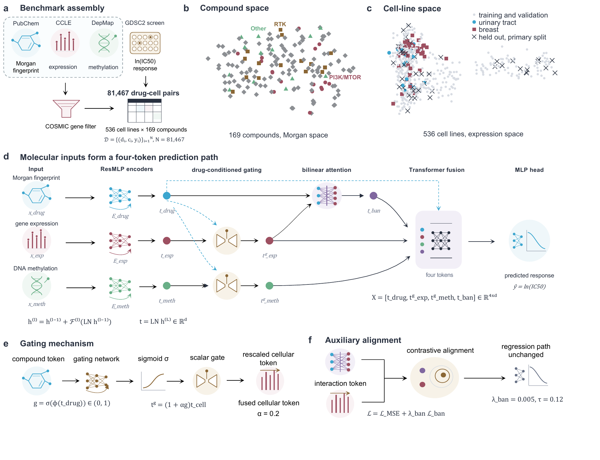

# BCGDRP

Code, trained checkpoints, analysis outputs and source data for
**Drug-conditioned multimodal learning for drug response prioritization in unseen cancer cell lines**.



BCGDRP predicts `ln(IC50 [µM])` from a 2,048-bit Morgan fingerprint, gene expression and DNA
methylation. The primary benchmark is cell-line-disjoint: response measurements from validation and
test cell lines are excluded from fitting and checkpoint selection.

## What is included

- final BCGDRP and BANDRP-Gate model code;
- the exact final hyperparameters in `configs/`;
- five checkpoints per model (seeds 2020--2024), with SHA-256 checksums;
- the public response matrix, compound information, fingerprints and frozen split;
- disease-hold-out predictions, CTRPv2 summaries and analysis outputs;
- curated source data and scripts for the quantitative figures and tables.

The COSMIC-derived feature matrices are intentionally excluded because their redistribution is
restricted. See [DATA_ACCESS.md](DATA_ACCESS.md). Their absence does not prevent validation of the
reported results, figures, source data or checkpoints, but the two final-model matrices must be added
locally to retrain the models or score new cell lines.

## Layout

```text
bcgdrp/              model, data and training modules
configs/             final experiment settings
scripts/             train, predict, evaluate and validation entry points
experiments/         ablations and statistical analyses
figures/             concise figure builders
data/                redistributable model and evaluation inputs
checkpoints/         ten final checkpoints and their manifest
results/             released numerical outputs and case predictions
source_data/         values underlying figures and tables
docs/                repository overview artwork
tests/               lightweight integrity and model tests
```

## Installation

The recorded environment uses Python 3.10 and PyTorch 2.1.2.

```bash
conda env create -f environment.yml
conda activate bcgdrp
```

Alternatively, in a Python 3.10 environment:

```bash
python -m pip install -r requirements.txt
python -m pip install -r requirements-figures.txt
```

## Verify the public release

These checks do not need the restricted matrices:

```bash
python scripts/check.py
python scripts/data.py
python -m pytest
python scripts/manifest.py --check
```

`check.py` rejects restricted filenames, local machine paths, cache files and
checkpoint or split checksum mismatches. `scripts/splits.py` regenerates the frozen primary split
and refreshes both split checksums.

## Train

After placing the authorized expression and methylation matrices as described in
[DATA_ACCESS.md](DATA_ACCESS.md):

```bash
python scripts/data.py --strict
python scripts/train.py --seed 2020
python scripts/train_gate.py --seed 2020
```

The YAML defaults reproduce the selected manuscript configurations. Use `--help` for paths, device,
batch size and epoch overrides.

## Predict and evaluate

An input prediction CSV needs `depmap_id` and `gdsc_pubchem_id` columns:

```bash
python scripts/predict.py pairs.csv predictions.csv --model bcgdrp --seed 2020
python scripts/eval.py --subset no_gdsc_response
```

The external evaluator filters the released harmonized CTRPv2 table and aggregates within-drug
Spearman correlations over the requested checkpoints.

## Figures

The overview above is provided in `docs/flowchart.png`. Figure scripts read released values from
`source_data/` or `results/` and write generated PDF and PNG files into `outputs/figures/`.
`fig1bc.py` regenerates the two data-driven panels of Figure 1; the remaining main and supplementary
builders regenerate the quantitative article figures.

```bash
python figures/fig1bc.py
python figures/fig2.py
python figures/fig3.py
python figures/fig4.py
python figures/fig5.py
python figures/fig6.py
python figures/fig7.py
python figures/supplement.py
```

## Reuse and citation

Code is released under the MIT License. Third-party data remain governed by their original terms.
Please cite the article and this software release; machine-readable author metadata are in
`CITATION.cff` and `.zenodo.json`. The archival DOI should be added after the Zenodo record is
published.

For correspondence: Guanxing Chen (`guanxing.chen@cityu-dg.edu.cn`), Yu-An Huang
(`yuanhuang@nwpu.edu.cn`) and Zhi-An Huang (`huang.za@cityu-dg.edu.cn`).
